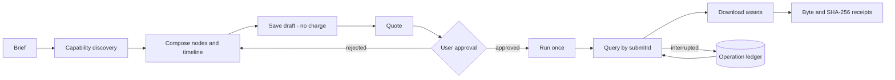

# Dreamina Canvas Plugin


> Build, quote, and run structured Dreamina canvases from Codex — with the free and paid steps kept apart.

[](https://github.com/full-aigc-plugins/dreamina-canvas-plugin/releases/tag/v0.1.5)
[](LICENSE)

[English](README.md) | [简体中文](README.zh-CN.md) · [Install](#installation) · [Quick start](#quick-start) · [Operation contract](#operation-contract) · [Troubleshooting](#troubleshooting)

## Positioning

`dreamina-canvas` turns an idea into a structured Dreamina canvas: typed nodes, a timeline, capability discovery at runtime, a free save step, then a quoted run that only executes after you approve it. Results are downloaded with byte counts and SHA-256 receipts.

The plugin is a strict wrapper around the installed `dreamina-canvas` CLI. It never hard-codes catalog values, never merges the save step with the run step, and never mints a replacement `submitId` to recover from a timeout.

### Who it is for

- Creators who want image, video, and audio nodes composed on one canvas without spending credits by accident.
- Engineers who need a scriptable, auditable adapter over the Dreamina Canvas CLI.
- Reviewers who need a quote, an approval record, and a verified artifact for every paid run.

### What problem it solves

| Problem | What this plugin provides | Verifiable entry point |
|---|---|---|
| Catalog values drift | Models, voices, ratios, and resolutions are discovered at runtime | `scripts/dreamina_canvas_adapter.py` |
| Saving silently costs money | Save and run are separate operations with a quote between them | `scripts/approval_guard.py` |
| A timeout invites double spending | Resume by the existing `submitId`; never mint a new one | `scripts/operation_ledger.py` |
| Downloads are unverified | Byte count and SHA-256 receipts | `scripts/artifact_guard.py` |

## At a glance

```text
Idea / brief
      │
      ▼
┌──────────────────────────────────────────────────────────┐
│ dreamina-canvas                                    │
│  ① discover   live models, voices, ratios, resolutions   │
│  ② compose    typed nodes and a timeline on the canvas   │
│  ③ save       draft, no charge                           │
│  ④ quote      authoritative cost for the planned run     │
│  ⑤ approve    explicit user decision, credit ceiling     │
│  ⑥ run        execute once, then query by submitId       │
│  ⑦ download   assets with byte and SHA-256 receipts      │
└──────────────────────────────────────────────────────────┘
      │
      ▼
Canvas project + verified local assets
```

| Property | Value |
|---|---|
| Plugin ID | `dreamina-canvas` |
| Host | Codex CLI or ChatGPT desktop app |
| Current version | `0.1.5` |
| Plugin manifest | `.codex-plugin/plugin.json` (compatibility) and `plugin.json` (portable) |
| MCP configuration | none — the plugin drives the local CLI through Skills |
| Primary language | Python 3.11+ |
| License | Apache-2.0 |

## Capabilities and boundaries

### Supported

| Capability | Input | Output | Limit | Status |
|---|---|---|---|---|
| Capability discovery | A live CLI session | Models, voices, ratios, resolutions | Read-only, never cached into source | Stable |
| Canvas composition | Brief plus discovered capabilities | Typed nodes and a timeline | Node set is fixed before quoting | Stable |
| Draft save | A composed canvas | Saved draft | Never charges credits | Stable |
| Quote | A planned run | Authoritative cost for the exact node set | Required before every paid run | Stable |
| Approved run | Quote plus explicit approval | One execution, then queryable state | One approval, one run, replay rejected | Stable |
| Asset download | Completed operations | Local files with byte and SHA-256 receipts | — | Stable |
| Operation resume | An existing `submitId` | Continued observation or a converged result | Never resubmits a paid run with a new identifier | Stable |

### Not responsible for

- Owning authentication. The `dreamina-canvas` CLI owns login and session state; this repository must not persist credentials.
- Choosing a model for you. Catalog values come from the live CLI, never from a hard-coded list.
- Installing or logging in to the CLI without your authorization.
- Retrying a paid operation on your behalf. An ambiguous submission escalates to a human decision instead.

### Maturity

| Status | Meaning |
|---|---|
| Stable | Automated tests plus recorded runtime evidence |
| Experimental | Behaviour may change; pin the version and verify |
| Blocked / NOT_RUN | Not verified; never present it as available |

## Architecture and core flow



### Component responsibilities

| Component | Owns | Does not own |
|---|---|---|
| `scripts/dreamina_canvas_adapter.py` | argv-only CLI invocation and typed errors | Business approval |
| `scripts/operation_ledger.py` | Non-secret operation receipts keyed by `submitId` | Authentication |
| `scripts/approval_guard.py` | Quote binding, credit ceiling, replay rejection | Cost estimation |
| `scripts/artifact_guard.py` | Download verification and receipts | Remote object lifetime |
| `scripts/error_router.py` | Mapping CLI exit codes to typed next actions | Retry execution |
| `skills/` (14) | Routing and per-capability instructions for Codex | Runtime enforcement |

## Compatibility

| Plugin version | Host | CLI | Python | Status |
|---|---|---|---|---|
| `0.1.5` | Codex CLI or ChatGPT desktop app | `dreamina-canvas` installed and authenticated by you | 3.11, 3.12, 3.13 (CI matrix) | Verified |

CLI runtime, version, command compatibility, explicitly authorized account authentication, and the separately approved paid canary are recorded as **PASS** in the [runtime evidence](docs/verification/dreamina-canvas-runtime.md).

## Installation

### From the plugin marketplace

```bash
codex plugin marketplace add full-aigc-plugins/dreamina-canvas-plugin --ref v0.1.5
codex plugin add dreamina-canvas@partme-ai-dreamina-canvas
```

Restart Codex or the ChatGPT desktop app, then open a new task so the Skills load.

### Prerequisites

- Python 3.11 or newer on `PATH`.
- The `dreamina-canvas` CLI installed on this machine. The plugin does not install it for you.
- Development extras only when you run the gates: `jsonschema` and `PyYAML` from `requirements-dev.txt`.

### Confirm it loaded

```bash
codex plugin list
```

Expected entry:

```text
dreamina-canvas@partme-ai-dreamina-canvas  installed, enabled
```

Then verify the packaged Skills still match their upstream lock file:

```bash
python scripts/verify_dreamina_canvas_skills.py
```

### China mirror (AtomGit)

If GitHub is slow or unreachable, install from the AtomGit mirror instead. The
commands are identical apart from the marketplace URL:

```bash
codex plugin marketplace add https://atomgit.com/partme-ai/partme-dreamina-canvas.git --ref main
codex plugin add dreamina-canvas@partme-ai-dreamina-canvas
```

To install the whole partme-ai plugin catalog from the mirror in one step:

```bash
codex plugin marketplace add https://atomgit.com/partme-ai/plugins.git
codex plugin add dreamina-canvas@partme-ai-dreamina-canvas
```

Notes:

- The AtomGit source and the GitHub source share marketplace names, so adding
  one replaces the other. Switch back with
  `codex plugin marketplace add https://github.com/partme-ai/plugins.git`.
- For ZCode or Kimi, clone the mirror repository and register the local
  directory in the respective marketplace configuration.

## Quick start

### 1. Prerequisites

- An authenticated `dreamina-canvas` CLI session.
- A project or canvas you are allowed to modify.
- A clear brief: what the canvas should contain and which output you want.

### 2. Ask for a canvas draft

```text
Create a Dreamina canvas for a 15-second product teaser. Draft the nodes and do not run anything yet.
```

Expected observation: the plugin discovers live capabilities, composes typed nodes, saves a draft, and reports that nothing has been charged.

### 3. Quote the run and approve it

```text
Quote this canvas run and wait for my approval.
```

Expected observation: a quote for the exact node set, with the credit total. Only after you approve does the run execute, once.

### 4. Resume or download

```text
Resume my Dreamina canvas operation and download the assets.
```

Expected observation: the operation is queried by its existing `submitId`; downloaded files come with byte counts and SHA-256 receipts.

## Configuration

There is no plugin configuration file and no credential in this repository. Behaviour is driven by CLI arguments plus your explicit approval.

| Setting | Where it lives | Notes |
|---|---|---|
| CLI binary | `dreamina-canvas` on `PATH` | Overridable through the adapter for controlled deployments |
| Authentication | The CLI's own store | The plugin never reads or writes it |
| Operation ledger | `<root>/operations/<profile-and-environment>/<submitId>.json` | Mode `0600`; non-secret fields only |
| Credit ceiling | Supplied with the approval | A ceiling below the latest authoritative total is refused |

## Operation contract

### Stable CLI exit codes and routed actions

| Exit code | Meaning | Routed action |
|---|---|---|
| `0` | Success | `continue` |
| `1` | Uncategorized internal failure | `alert` |
| `2` | Invalid command, argument, or schema | `fix_and_retry` |
| `10` | Structured credit approval required | `approval_pause` |
| `11` | Login required or session expired | `reauth_and_retry` |
| `12` | Permission, capability, or entitlement denied | `escalate` |
| `13` | Environment or release compatibility blocked | `upgrade_cli` |
| `20` | Operation recoverable, not yet converged | `resume_operation` |
| `21` | Retryable service or transport failure | `bounded_backoff_retry` |
| `22` | Human intervention required | `hand_to_human` |

### Approval rules

- No quote means no approval is possible; the guard refuses.
- An approval is bound to the quoted node set and its project.
- A credit ceiling below the latest authoritative total is refused.
- Consuming an approval twice is rejected as a replay.

## Retry, idempotency, and recovery

- A timeout or ambiguous submission is resumed through the existing `submitId`; a replacement identifier is never minted automatically.
- A missing ledger record for a resubmittable operation escalates to a human rather than retrying.
- An operation that is in progress or completed is observed, never re-run.
- Retryable transport failures use bounded backoff; approval, permission, and compatibility failures do not retry at all.
- Only non-secret identifiers are persisted: the ledger stores project, node, and submit identifiers, state, fingerprints, exit codes, and timestamps.

## Data and state

| Data | Location | Lifecycle | Secrets |
|---|---|---|---|
| Operation receipt | `<root>/operations/<profile-and-environment>/<submitId>.json` | Until you delete it | None; non-secret fields only |
| Downloaded assets | Your chosen download directory | Until you delete them | None |
| Canvas project | Dreamina's own service | Owned by the service | Managed by the CLI |

Ledger files are written with mode `0600`, and credential-like fields are rejected before anything is persisted.

## Security

- Authentication stays with the CLI; this repository must not persist credentials.
- Only non-secret operation fields are written to the ledger, and credential-like field names are rejected outright.
- Paid execution requires a fresh quote plus an explicit approval bound to that quote.
- A consumed approval cannot be replayed.
- The adapter invokes the CLI through argv arrays only; it never builds a shell string.
- The plugin does not install the CLI or authenticate on your behalf without authorization.

## Development and verification

```bash
python -m unittest discover -s tests -v
python -m unittest discover -s tests/scenarios -v
python scripts/verify_dreamina_canvas_skills.py
python scripts/validate_distribution.py
```

Recorded evidence:

- [Offline verification](docs/verification/offline.md) — the offline gate result for this revision.
- [Runtime evidence](docs/verification/dreamina-canvas-runtime.md) — CLI runtime, version, and command compatibility.
- [Production readiness](docs/verification/production-readiness.md) and [real-environment acceptance](docs/verification/real-environment-acceptance-2026-09-13.md).
- [Atomic Skills](docs/verification/atomic-skills.md) — packaged Skills match the upstream lock file byte for byte.

## Troubleshooting

| Symptom | Check first | Resolution |
|---|---|---|
| Tools or Skills are missing | Plugin status | Restart Codex and open a new task |
| The CLI is not found | `dreamina-canvas` on `PATH` | Install the CLI; the plugin will not do it silently |
| A run pauses with an approval request | The pending quote | Review the credit total, then approve or reject |
| A run times out | The ledger entry | Resume by the existing `submitId`; do not re-quote blindly |
| A download fails verification | The receipt | Re-download; a mismatched byte count or digest is a hard failure |
| Login is required | The CLI session | Authenticate with the CLI, then retry |

## Project structure

```text
partme-dreamina-canvas/
├── .codex-plugin/plugin.json   # compatibility manifest
├── plugin.json                 # portable manifest
├── .agents/plugins/marketplace.json
├── scripts/                    # adapter, ledger, guards, validators
├── skills/                     # 13 canvas Skills
├── tests/                      # unit tests plus scenario tests
├── upstream/                   # pinned upstream snapshot and lock file
└── docs/                       # architecture, technical solution, verification
```

## Deep links

- [Architecture](docs/Dreamina-Canvas-Plugin-Architecture.md) · [架构文档](docs/Dreamina-Canvas-Plugin-Architecture.zh_CN.md)
- [Technical solution](docs/Dreamina-Canvas-Plugin-Technical-Solution.md) · [技术方案](docs/Dreamina-Canvas-Plugin-Technical-Solution.zh_CN.md)
- [Design spec](docs/superpowers/specs/2026-09-11-dreamina-canvas-plugin-design.md)
- [Implementation plan](docs/superpowers/plans/2026-09-11-dreamina-canvas-plugin-implementation.md)
- [Contributing](CONTRIBUTING.md) · [Security policy](SECURITY.md)

## Contributing and support

Open functional issues at <https://github.com/full-aigc-plugins/dreamina-canvas-plugin/issues>. Before proposing a change, state the CLI version you verified against, whether it alters the approval binding or the ledger format, and include the affected tests.

## License

Apache-2.0 — see [LICENSE](LICENSE).
