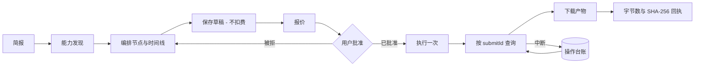

# Dreamina Canvas 插件


> 在 Codex 中构建、报价并运行结构化的 Dreamina 画布——免费步骤与付费步骤严格分离。

[](https://github.com/full-aigc-plugins/dreamina-canvas-plugin/releases/tag/v0.1.4)
[](LICENSE)

[English](README.md) | [简体中文](README.zh-CN.md) · [安装](#安装) · [快速开始](#快速开始) · [操作契约](#操作契约) · [故障排查](#故障排查)

## 项目定位

`dreamina-canvas` 把想法变成结构化的 Dreamina 画布：带类型的节点、时间线、运行时能力发现、一次免费的保存，以及只有在你批准后才执行的报价运行。产物下载时附带字节数与 SHA-256 回执。

插件是已安装 `dreamina-canvas` CLI 的严格包装：从不写死目录值，从不把保存与运行合并为一步，也从不为了从超时中恢复而重新生成 `submitId`。

### 适合谁

- 希望在一块画布上组合图片、视频与音频节点，又不想意外扣费的创作者。
- 需要可脚本化、可审计地驱动 Dreamina Canvas CLI 的工程师。
- 需要为每次付费运行拿到报价、批准记录与可核实产物的审阅者。

### 解决什么问题

| 问题 | 本插件提供 | 可验证入口 |
|---|---|---|
| 目录值会漂移 | 模型、音色、比例、分辨率在运行时发现 | `scripts/dreamina_canvas_adapter.py` |
| 保存会偷偷花钱 | 保存与运行分离，中间夹一次报价 | `scripts/approval_guard.py` |
| 超时容易导致重复扣费 | 用已有的 `submitId` 续查，绝不重新生成 | `scripts/operation_ledger.py` |
| 下载没有校验 | 字节数与 SHA-256 回执 | `scripts/artifact_guard.py` |

## 一眼看懂

```text
想法 / 需求简报
      │
      ▼
┌──────────────────────────────────────────────────────────┐
│ dreamina-canvas                                    │
│  ① discover   实时发现模型、音色、比例、分辨率           │
│  ② compose    在画布上组合带类型的节点与时间线           │
│  ③ save       保存草稿，不扣费                           │
│  ④ quote      为本次计划运行给出权威报价                 │
│  ⑤ approve    用户明确批准，并设定额度上限               │
│  ⑥ run        只执行一次，之后按 submitId 查询           │
│  ⑦ download   下载产物并校验字节数与 SHA-256             │
└──────────────────────────────────────────────────────────┘
      │
      ▼
画布工程 + 经验证的本地产物
```

| 项目属性 | 值 |
|---|---|
| 插件 ID | `dreamina-canvas` |
| 宿主 | Codex CLI 或 ChatGPT 桌面应用 |
| 当前版本 | `0.1.4` |
| 插件清单 | `.codex-plugin/plugin.json`（兼容）与 `plugin.json`（便携） |
| MCP 配置 | 无——插件通过 Skills 驱动本地 CLI |
| 主要语言 | Python 3.11+ |
| 许可证 | Apache-2.0 |

## 能力与边界

### 已支持

| 能力 | 输入 | 输出 | 限制 | 状态 |
|---|---|---|---|---|
| 能力发现 | 一个活跃的 CLI 会话 | 模型、音色、比例、分辨率 | 只读，绝不写进源码缓存 | 稳定 |
| 画布编排 | 需求简报 + 已发现的能力 | 带类型的节点与时间线 | 报价前固定节点集合 | 稳定 |
| 草稿保存 | 已编排的画布 | 已保存的草稿 | 绝不消耗额度 | 稳定 |
| 报价 | 计划中的运行 | 针对确切节点集合的权威费用 | 每次付费运行前都必须 | 稳定 |
| 已批准运行 | 报价 + 明确批准 | 一次执行，之后状态可查询 | 一次批准一次运行，重放被拒 | 稳定 |
| 产物下载 | 已完成的操作 | 带字节数与 SHA-256 回执的本地文件 | — | 稳定 |
| 操作续查 | 已有的 `submitId` | 继续观察或得到收敛结果 | 绝不用新标识重提付费运行 | 稳定 |

### 不负责

- 拥有认证。`dreamina-canvas` CLI 负责登录与会话状态；本仓库不得持久化凭据。
- 替你选择模型。目录值一律来自实时 CLI，绝不来自硬编码清单。
- 未经你授权就安装 CLI 或发起登录。
- 替你重试付费操作。结果不确定时升级为人工决策，而不是自动重试。

### 成熟度

| 状态 | 含义 |
|---|---|
| 稳定 | 有自动化测试与已记录运行证据 |
| 实验性 | 行为可能调整；请固定版本并自行验证 |
| 封锁 / NOT_RUN | 未验证；不得描述为可用 |

## 架构与核心流程



### 组件职责

| 组件 | 负责 | 不负责 |
|---|---|---|
| `scripts/dreamina_canvas_adapter.py` | 仅用 argv 调用 CLI 并给出带类型的错误 | 业务批准 |
| `scripts/operation_ledger.py` | 以 `submitId` 为键的非敏感操作回执 | 认证 |
| `scripts/approval_guard.py` | 报价绑定、额度上限、拒绝重放 | 成本估算 |
| `scripts/artifact_guard.py` | 下载校验与回执 | 远端对象生命周期 |
| `scripts/error_router.py` | 把 CLI 退出码映射为带类型的下一步动作 | 重试执行 |
| `skills/`（14 个） | 供 Codex 使用的路由与逐能力指令 | 运行时强制 |

## 兼容性

| 插件版本 | 宿主 | CLI | Python | 状态 |
|---|---|---|---|---|
| `0.1.4` | Codex CLI 或 ChatGPT 桌面应用 | 由你安装并完成认证的 `dreamina-canvas` | 3.11、3.12、3.13（CI 矩阵） | 已验证 |

CLI 运行期、版本、命令兼容性、经明确授权的账号认证，以及单独批准的付费金丝雀，均在[运行期证据](docs/verification/dreamina-canvas-runtime.md)中记录为 **PASS**。

## 安装

### 从插件市场安装

```bash
codex plugin marketplace add partme-ai/partme-dreamina-canvas --ref main
codex plugin add dreamina-canvas@partme-ai-dreamina-canvas
```

重启 Codex 或 ChatGPT 桌面应用，然后新建任务以加载 Skills。

### 前置条件

- `PATH` 上有 Python 3.11 或更新版本。
- 本机已安装 `dreamina-canvas` CLI。插件不会替你安装它。
- 只有运行本地门禁时才需要开发依赖：`requirements-dev.txt` 中的 `jsonschema` 与 `PyYAML`。

### 确认加载成功

```bash
codex plugin list
```

预期条目：

```text
dreamina-canvas@partme-ai-dreamina-canvas  installed, enabled
```

再确认打包的 Skill 与上游锁文件一致：

```bash
python scripts/verify_dreamina_canvas_skills.py
```

### 国内镜像（AtomGit）

如果 GitHub 访问缓慢或不可达，可改用 AtomGit 镜像安装。命令完全一致，只把市场地址换成镜像：

```bash
codex plugin marketplace add https://atomgit.com/partme-ai/partme-dreamina-canvas.git --ref main
codex plugin add dreamina-canvas@partme-ai-dreamina-canvas
```

如需一步安装 partme-ai 全部插件目录：

```bash
codex plugin marketplace add https://atomgit.com/partme-ai/plugins.git
codex plugin add dreamina-canvas@partme-ai-dreamina-canvas
```

注意事项：

- AtomGit 源与 GitHub 源共用市场名，后添加的会覆盖先添加的。切回官方源执行
  `codex plugin marketplace add https://github.com/partme-ai/plugins.git`。
- ZCode 与 Kimi 用户可先将镜像仓库克隆到本地，再在各平台的 marketplace 配置中登记本地目录。

## 快速开始

### 1. 前置条件

- 一个已完成认证的 `dreamina-canvas` CLI 会话。
- 一个你有权修改的工程或画布。
- 一份清晰的简报：画布应包含什么、你想要哪种产物。

### 2. 先要一份画布草稿

```text
为一个 15 秒产品预告片创建 Dreamina 画布。先编排节点，不要运行任何东西。
```

预期观察：插件先做实时能力发现，再组合带类型的节点，保存草稿，并明确报告尚未产生任何扣费。

### 3. 报价并批准运行

```text
为这次画布运行报价，然后等我的批准。
```

预期观察：针对确切节点集合的报价与额度总计。只有你批准之后才会执行一次。

### 4. 续查或下载

```text
续查我的 Dreamina 画布操作并下载产物。
```

预期观察：操作用已有的 `submitId` 查询；下载的文件带字节数与 SHA-256 回执。

## 配置

本插件没有配置文件，本仓库也没有凭据。行为由 CLI 参数加你的明确批准共同决定。

| 设置 | 所在位置 | 说明 |
|---|---|---|
| CLI 可执行文件 | `PATH` 上的 `dreamina-canvas` | 受控部署可在适配器中覆盖 |
| 认证 | CLI 自己的存储 | 插件从不读写 |
| 操作台账 | `<root>/operations/<profile-and-environment>/<submitId>.json` | 权限 `0600`，仅非敏感字段 |
| 额度上限 | 随批准一起提供 | 低于最新权威总计的上限会被拒绝 |

## 操作契约

### 稳定的 CLI 退出码与路由动作

| 退出码 | 含义 | 路由动作 |
|---|---|---|
| `0` | 成功 | `continue` |
| `1` | 未归类的内部失败 | `alert` |
| `2` | 命令、参数或 schema 非法 | `fix_and_retry` |
| `10` | 需要结构化的额度批准 | `approval_pause` |
| `11` | 需要登录或会话已过期 | `reauth_and_retry` |
| `12` | 权限、能力或权益被拒绝 | `escalate` |
| `13` | 环境或版本兼容性受阻 | `upgrade_cli` |
| `20` | 操作可恢复但尚未收敛 | `resume_operation` |
| `21` | 可重试的服务或传输故障 | `bounded_backoff_retry` |
| `22` | 需要人工介入 | `hand_to_human` |

### 批准规则

- 没有报价就无法批准；守卫会直接拒绝。
- 批准绑定到已报价的节点集合及其工程。
- 低于最新权威总计的额度上限会被拒绝。
- 同一次批准被消费两次会被判定为重放并拒绝。

## 重试、幂等与恢复

- 超时或提交结果不确定时，用已有的 `submitId` 续查；绝不自动生成替代标识。
- 可重提交的操作若缺少台账记录，会升级为人工处理，而不是重试。
- 处于进行中或已完成的操作只做观察，绝不重跑。
- 可重试的传输故障采用有界退避；批准、权限与兼容性失败一律不重试。
- 只持久化非敏感标识：台账保存工程、节点与提交标识、状态、指纹、退出码与时间戳。

## 数据与状态

| 数据 | 位置 | 生命周期 | 是否含秘密 |
|---|---|---|---|
| 操作回执 | `<root>/operations/<profile-and-environment>/<submitId>.json` | 直到你删除 | 否；仅非敏感字段 |
| 已下载产物 | 你选择的下载目录 | 直到你删除 | 否 |
| 画布工程 | Dreamina 自身服务 | 由服务方持有 | 由 CLI 管理 |

台账文件以 `0600` 权限写入，且任何形似凭据的字段都会在落盘前被拒绝。

## 安全

- 认证留在 CLI；本仓库不得持久化凭据。
- 台账只写入非敏感操作字段，形似凭据的字段名会被直接拒绝。
- 付费执行需要一次新的报价，加上绑定该报价的明确批准。
- 已消费的批准无法重放。
- 适配器只用 argv 数组调用 CLI，从不拼接 shell 字符串。
- 未经授权，插件不会安装 CLI 或替你完成认证。

## 开发与验证

```bash
python -m unittest discover -s tests -v
python -m unittest discover -s tests/scenarios -v
python scripts/verify_dreamina_canvas_skills.py
python scripts/validate_distribution.py
```

仓库中已记录的证据：

- [离线验证](docs/verification/offline.md)——当前版本的离线门禁结果。
- [运行期证据](docs/verification/dreamina-canvas-runtime.md)——CLI 运行期、版本与命令兼容性。
- [生产就绪](docs/verification/production-readiness.md) 与[真实环境验收](docs/verification/real-environment-acceptance-2026-09-13.md)。
- [原子 Skill](docs/verification/atomic-skills.md)——打包的 Skill 与上游锁文件逐字节一致。

## 故障排查

| 现象 | 优先检查 | 处理方式 |
|---|---|---|
| 工具或 Skill 缺失 | 插件状态 | 重启 Codex 并新建任务 |
| 找不到 CLI | `PATH` 上的 `dreamina-canvas` | 自行安装 CLI；插件不会静默处理 |
| 运行停在批准请求 | 待处理的报价 | 核对额度总计，再批准或拒绝 |
| 运行超时 | 台账条目 | 用已有的 `submitId` 续查，不要盲目重新报价 |
| 下载校验失败 | 回执 | 重新下载；字节数或摘要不符即为硬失败 |
| 需要登录 | CLI 会话 | 用 CLI 完成认证后重试 |

## 项目结构

```text
partme-dreamina-canvas/
├── .codex-plugin/plugin.json   # 兼容清单
├── plugin.json                 # 便携清单
├── .agents/plugins/marketplace.json
├── scripts/                    # 适配器、台账、守卫、校验器
├── skills/                     # 13 个画布 Skill
├── tests/                      # 单元测试与场景测试
├── upstream/                   # 固定的上游快照与锁文件
└── docs/                       # 架构、技术方案、验证记录
```

## 深入文档

- [Architecture](docs/Dreamina-Canvas-Plugin-Architecture.md) · [架构文档](docs/Dreamina-Canvas-Plugin-Architecture.zh_CN.md)
- [Technical solution](docs/Dreamina-Canvas-Plugin-Technical-Solution.md) · [技术方案](docs/Dreamina-Canvas-Plugin-Technical-Solution.zh_CN.md)
- [设计规格](docs/superpowers/specs/2026-09-11-dreamina-canvas-plugin-design.md)
- [实施计划](docs/superpowers/plans/2026-09-11-dreamina-canvas-plugin-implementation.md)
- [贡献指南](CONTRIBUTING.md) · [安全策略](SECURITY.md)

## 贡献与支持

功能问题请提交到 <https://github.com/partme-ai/partme-dreamina-canvas/issues>。提交变更前，请说明你验证所用的 CLI 版本、是否改动批准绑定或台账格式，并附上受影响的测试。

## 许可证

Apache-2.0，见 [LICENSE](LICENSE)。
