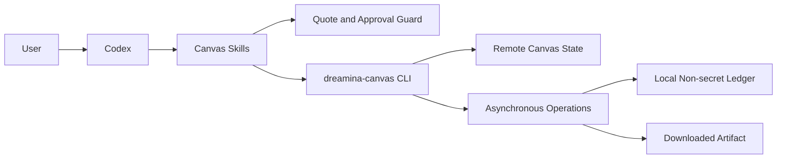
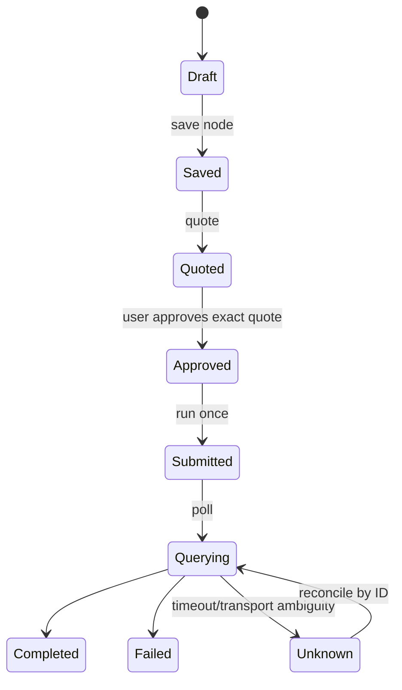

# Codex Dreamina Canvas Plugin Architecture

> Implemented. Updated 2026-09-12. Runtime evidence is recorded in `docs/verification/`.

## Context

## Responsibilities

| Component | Owns |
|---|---|
| capability adapter | `version`, `schema`, model and voice discovery |
| canvas planner | canvas/node/timeline intent and reference validation |
| cost guard | quote fingerprint, approval scope, expiry, amount |
| operation ledger | non-secret IDs, request fingerprint, last known state |
| recovery loop | bounded polling, terminal states, resumability |
| downloader | approved destination, checksum, media receipt |

## State machine

No transition from `Unknown` to `Submitted` is automatic. Approval is bound to an exact quote and invalidated by request changes.

## Security and operations

Authentication belongs to the CLI. The plugin stores no token, never prints account details, and does not infer membership or credit availability. Logs contain stable non-secret identifiers and state transitions only.

## Dependency

The Skill source of truth is the `full-aigc-skills/dreamina-skills` repository, pinned by commit in `upstream/dreamina-skills.lock.json`. This plugin packages only the Canvas subset and plugin-specific guardrails.
