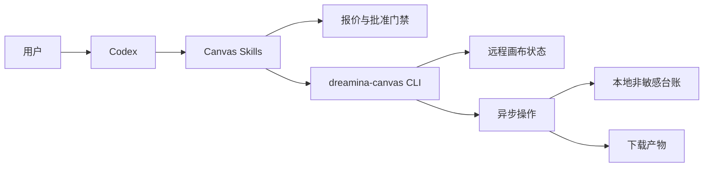
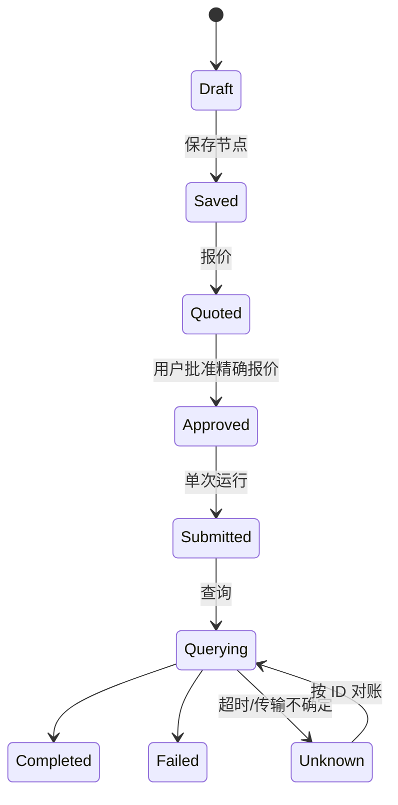

# Codex Dreamina Canvas 插件架构

> 已实现。更新日期 2026-09-12。运行期证据记录在 `docs/verification/`。

## 系统上下文

## 组件职责

| 组件 | 负责 |
|---|---|
| 能力适配器 | `version`、`schema`、模型和音色发现 |
| 画布规划器 | 画布/节点/时间轴意图和引用校验 |
| 费用门禁 | 报价指纹、批准范围、有效期和金额 |
| 操作台账 | 非敏感 ID、请求指纹、最后状态 |
| 恢复循环 | 有界轮询、终态和恢复 |
| 下载器 | 已批准目标路径、校验和、媒体回执 |

## 状态机

`Unknown` 不得自动回到 `Submitted`。批准绑定精确报价，请求变化后自动失效。

## 安全与运维

认证由 CLI 持有。插件不保存 token、不打印账号详情、不推断会员或积分余额。日志只记录稳定非敏感标识和状态迁移。

## 依赖

Skill 事实源是 `full-aigc-skills/dreamina-skills` 仓库，并按提交固定在 `upstream/dreamina-skills.lock.json`。本插件只打包 Canvas 子集和插件专属 Guardrails。
