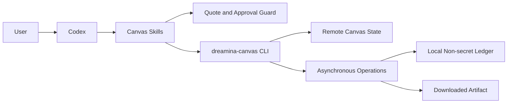
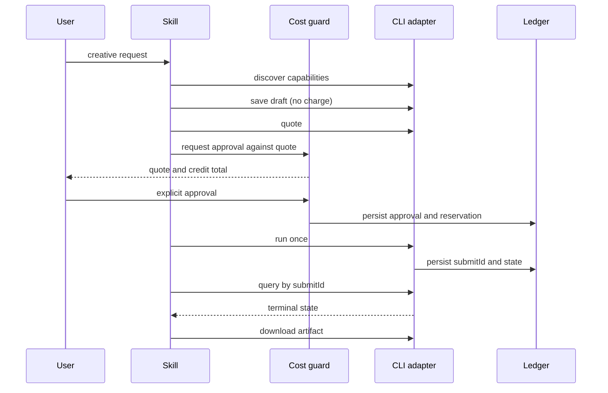
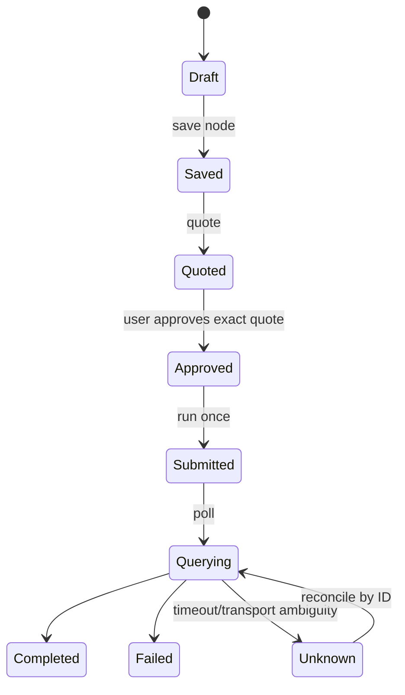

# Dreamina Canvas Plugin Architecture

> **Document control**
>
> | Field | Value |
> |---|---|
> | Status | Implemented and released as `0.1.2` |
> | Scope | The Codex plugin in this repository: the CLI adapter, guards, ledger, and Skills |
> | Audience | Plugin maintainers, security reviewers, and integration engineers |
> | Out of scope | The Dreamina Canvas service itself, the CLI's internals, and the upstream Skill library |
> | Runtime evidence | `docs/verification/` |
> | Last structural revision | 2026-09-14 |

## 1. Executive summary

This repository packages the Dreamina Canvas CLI for Codex as a guarded extension. It does not implement generation, pricing, or authentication. It implements the contract that turns an open-ended creative request into a bounded, budgeted, resumable operation:

- capability values are discovered at runtime, never hard-coded;
- saving and running are separate operations;
- a cost-bearing run requires a fresh quote and an explicit approval bound to that quote;
- an uncertain result is resumed through its existing identifier, never resubmitted.

The architecture exists to make those four guarantees enforceable in code rather than aspirational in documentation.

## 2. Drivers and constraints

| Driver | Consequence for the architecture |
|---|---|
| Catalog values change without notice | No model, voice, ratio, or resolution is stored in source; every run reads the live catalog |
| Spending real credits is irreversible | Approval is a first-class persisted object, not a boolean argument |
| Long-running remote work times out | Every submission is identified by `submitId` before any success is reported |
| Users may run several profiles | State is partitioned per profile and environment |
| The CLI owns authentication | This repository never stores or prints a credential |

### Non-goals

- Reimplementing any part of the Dreamina Canvas service or its CLI.
- Choosing creative parameters on the user's behalf.
- Automatic retry of a paid operation under any failure mode.
- Managing credentials, membership, or entitlement.

## 3. Context and trust boundary

| Boundary | Inside | Outside |
|---|---|---|
| This repository | Skills, adapter, guards, ledger, validators | — |
| The CLI | Authentication, remote API, catalog, generation | Invoked through argv only |
| The service | Canvas state, credits, artifact lifetime | Reached only through the CLI |

The trust boundary is deliberate: everything that touches credentials or money lives behind the CLI, and this repository treats the CLI as an external system with a typed, argv-only interface.

## 4. Current state, target state, and gaps

| Capability | Current | Target | Gap |
|---|---|---|---|
| Capability discovery | Implemented | Stay live | None |
| Quote and approval | Implemented, with a credit ceiling | Unchanged | None |
| Operation resume by `submitId` | Implemented | Unchanged | None |
| Artifact verification | Byte count and SHA-256 | Unchanged | None |
| Cost estimation | Delegated to the CLI's quote | Same | This repository never estimates cost itself |
| Credential handling | Not owned | Not owned | Intentionally absent |

No capability is partially implemented: each row is either owned and delivered here, or explicitly delegated. That distinction is the honesty contract of this document.

## 5. Principles and decisions

| Decision | Rationale | Reversal condition |
|---|---|---|
| Discover capabilities at runtime | A hard-coded catalog silently rots and would mislead users | Only if the CLI publishes a stable, versioned catalog guarantee |
| Separate save from run | Saving is free; conflating the two makes accidental spend impossible to review | None |
| Bind approval to a quote fingerprint | An approval for one node set must not authorize another | None |
| Never mint a replacement `submitId` | A duplicate identifier is how one paid action becomes two | Only if the CLI exposes an idempotent run key |
| Persist only non-secret fields | The ledger is on disk and outlives the session | None |

## 6. Components and dependencies

| Component | Owns | Does not own |
|---|---|---|
| capability adapter | `version`, `schema`, model and voice discovery | Catalog policy |
| canvas planner | canvas/node/timeline intent and reference validation | Cost |
| cost guard | quote fingerprint, approval scope, expiry, amount | Quote computation |
| operation ledger | non-secret IDs, request fingerprint, last known state | Remote state |
| recovery loop | bounded polling, terminal states, resumability | Resubmission |
| downloader | approved destination, checksum, media receipt | Remote object lifetime |

Dependency direction is one-way: Skills call guards, guards call the adapter, the adapter calls the CLI. No component reaches back up the chain, and no component calls the remote API directly.

## 7. Runtime and core flows

### 7.1 Primary flow

### 7.2 State machine

### 7.3 Failure and recovery semantics

| Failure | Detection | Behavior | Recovery |
|---|---|---|---|
| Quote changed | Fingerprint mismatch | Approval is refused | Re-quote and re-approve |
| Approval expired | Timestamp check | Approval is refused | Request a new approval |
| Approval replayed | Consumption record exists | Refused as a replay | Start a new approved run |
| Transport timeout | Adapter outcome ambiguous | Ledger records `Unknown`; no resubmission | Query the existing `submitId` |
| Service failure | Non-zero CLI exit | Routed by exit code | Follow the routed action |
| Download mismatch | Byte count or digest difference | Download is rejected | Re-download the same artifact |

No transition from `Unknown` to `Submitted` is automatic. Approval is bound to an exact quote and invalidated by request changes.

## 8. State, data, and protocol

| Data | Owner | Location | Consistency |
|---|---|---|---|
| Operation receipt | operation ledger | `<root>/operations/<profile-and-environment>/<submitId>.json`, mode `0600` | Atomic write, keyed by `submitId` |
| Approval receipt | cost guard | Guard-owned store | Single use, expiring |
| Downloaded artifact | downloader | Approved destination | Byte count and SHA-256 verified on arrival |
| Catalog values | CLI | Never persisted here | Read live on every run |

The protocol surface is the CLI's JSON output plus its exit codes. Exit codes are mapped to typed actions, so a caller never has to parse a human message to decide what to do next.

## 9. Security

- Authentication belongs to the CLI; this repository stores no token and prints no account detail.
- Only non-secret identifiers are persisted: project, node, and submit identifiers, state, fingerprints, exit codes, and timestamps.
- Credential-like field names are rejected before anything is written.
- The adapter builds argv arrays only; it never constructs a shell string.
- The plugin never installs the CLI or authenticates on the user's behalf without authorization.

## 10. Resource and operational budgets

| Budget | Value | Rationale |
|---|---|---|
| Polling | Bounded, with backoff | A remote job may outlive a session, but polling must not become a busy loop |
| Approval lifetime | Short and explicit | An approval is a decision about a specific quote at a specific time |
| Ledger size | One file per operation | Bounded by the number of operations the user ran |
| Retryable failures | Transport only | Approval, permission, and compatibility failures never retry |

### Operations

Operations are executable rather than aspirational: `python -m unittest discover -s tests -v`, `python -m unittest discover -s tests/scenarios -v`, `python scripts/verify_dreamina_canvas_skills.py`, and `python scripts/validate_distribution.py`. The Skill-lock check is what makes "we package the upstream Skills unchanged" a testable claim.

## 11. Deployment, compatibility, and evolution

| Aspect | Position |
|---|---|
| Distribution | Cross-host marketplace entry pointing at this repository, pinned to immutable `v0.1.5` |
| Manifests | `.codex-plugin/plugin.json` (compatibility) and `plugin.json` (portable) |
| Python | 3.11, 3.12, and 3.13 in the CI matrix |
| Upstream Skills | Pinned by commit in `upstream/dreamina-skills.lock.json` and byte-verified |
| Rollback | Restore the previous pinned commit and reinstall; the ledger format is append-only per operation |

Risks and their mitigations:

| Risk | Mitigation |
|---|---|
| Upstream Skill drift | Byte-parity check against the lock file fails the build |
| CLI incompatibility | Exit code `13` routes to an explicit upgrade action instead of a silent failure |
| Operator confusion between save and run | The two operations are separate commands with separate receipts |

## 12. Evidence map

| Claim | Evidence |
|---|---|
| Components and dependency direction | `scripts/` sources and the distribution validator |
| Approval binding and replay rejection | `scripts/approval_guard.py` and its tests |
| Exit-code routing | `scripts/error_router.py` and its tests |
| Skill parity with upstream | `scripts/verify_dreamina_canvas_skills.py` output |
| Runtime behavior | `docs/verification/dreamina-canvas-runtime.md` |
| Real-environment acceptance | `docs/verification/real-environment-acceptance-2026-09-13.md` |
