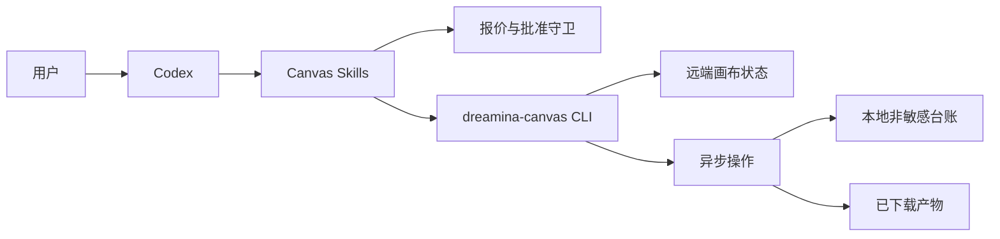
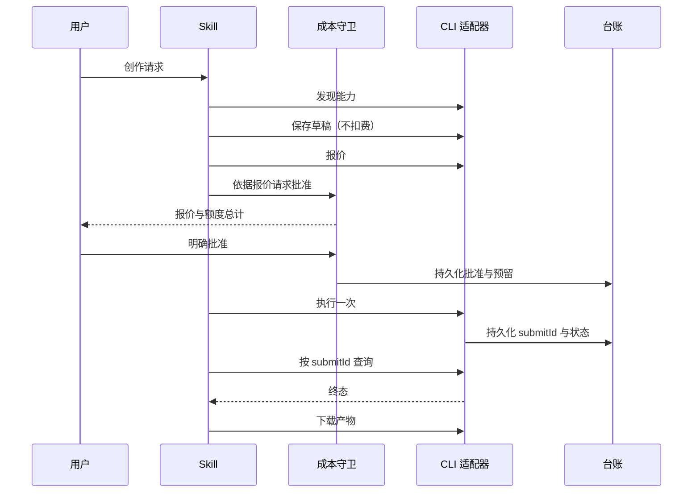
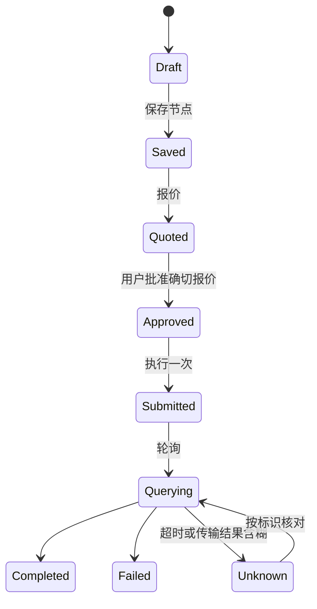

# Dreamina Canvas 插件架构

> **文档信息**
>
> | 字段 | 值 |
> |---|---|
> | 状态 | 核心契约已实现，以 `0.1.7` 发布；视觉质量闭环计划中，尚未实现 |
> | 范围 | 本跨宿主插件的 CLI 适配器、各类守卫、台账、Skills 与计划中的视觉闭环扩展 |
> | 读者 | 插件维护者、安全审阅者与集成工程师 |
> | 不在范围 | Dreamina Canvas 服务本身、CLI 内部实现与上游 Skill 库 |
> | 运行证据 | `docs/verification/` |
> | 最近一次结构修订 | 2026-09-14 |

## 1. 执行摘要

本仓库把 Dreamina Canvas CLI 封装成 Codex 的受控扩展。它不实现生成、定价或认证，而实现那条把开放的创作请求变成有界、有预算、可恢复操作的契约：

- 能力值在运行时发现，绝不硬编码；
- 保存与运行是两个独立操作；
- 产生费用的运行需要一次新的报价，以及绑定该报价的明确批准；
- 结果不确定时用已有标识续查，绝不重新提交。

架构存在的意义，是让上面四条保证在代码里可被强制，而不是只写在文档里。

## 2. 驱动力与约束

| 驱动力 | 对架构的后果 |
|---|---|
| 目录值会随时变化 | 源码中不保存任何模型、音色、比例或分辨率；每次运行都读实时目录 |
| 花费真实额度不可逆 | 批准是一等持久对象，而不是一个布尔参数 |
| 远端任务会长时间运行并超时 | 任何成功报告之前，提交都必须先有 `submitId` |
| 用户可能使用多个 profile | 状态按 profile 与环境分区 |
| 认证由 CLI 负责 | 本仓库绝不存储或打印凭据 |

### 非目标

- 重实现 Dreamina Canvas 服务或其 CLI 的任何部分。
- 替用户做创作参数决策。
- 在任何失败模式下自动重试付费操作。
- 管理凭据、会员或权益。

## 3. 上下文与信任边界

| 边界 | 内部 | 外部 |
|---|---|---|
| 本仓库 | Skills、适配器、各类守卫、台账、校验器 | — |
| CLI | 认证、远端 API、目录、生成 | 仅通过 argv 调用 |
| 服务 | 画布状态、额度、产物生命周期 | 只经由 CLI 触达 |

信任边界是刻意设计的：所有与凭据或金钱相关的事都在 CLI 之后，本仓库只把 CLI 当作一个仅用 argv 的带类型外部系统。

## 4. 当前状态、目标状态与差距

| 能力 | 当前 | 目标 | 差距 |
|---|---|---|---|
| 能力发现 | 已实现 | 保持实时 | 无 |
| 报价与批准 | 已实现，含额度上限 | 不变 | 无 |
| 按 `submitId` 续查操作 | 已实现 | 不变 | 无 |
| 产物校验 | 字节数与 SHA-256 | 不变 | 无 |
| 成本估算 | 委托给 CLI 的报价 | 相同 | 本仓库绝不自行估算成本 |
| 凭据处理 | 不拥有 | 不拥有 | 有意缺失 |
| 视觉目标与质量闭环 | 尚未实现 | 目标锁定、单轮控制器、JudgePort、修订和有界策略 | 活跃 change `add-canvas-visual-quality-loop` |

该表把稳定核心与计划能力分开。现有适配器、台账、下载回执或 Harness 文档都不代表
视觉闭环控制器已经存在；其实现和证据由
[`add-canvas-visual-quality-loop`](../openspec/changes/add-canvas-visual-quality-loop/proposal.md)
跟踪。

## 5. 原则与决策

| 决策 | 理由 | 反转条件 |
|---|---|---|
| 运行时发现能力 | 硬编码目录会悄悄腐坏，并误导用户 | 仅当 CLI 承诺稳定的版本化目录 |
| 保存与运行分离 | 保存免费；混在一起会让意外花费无法复核 | 无 |
| 批准绑定报价指纹 | 针对一组节点的批准不得授权另一组 | 无 |
| 绝不重新生成 `submitId` | 重复标识是一次付费动作变成两次的方式 | 仅当 CLI 暴露幂等的运行键 |
| 只持久化非敏感字段 | 台账在磁盘上，且比会话活得更久 | 无 |

## 6. 组件与依赖

| 组件 | 负责 | 不负责 |
|---|---|---|
| 能力适配器 | `version`、`schema`、模型与音色发现 | 目录策略 |
| 画布规划器 | 画布/节点/时间线意图与引用校验 | 成本 |
| 成本守卫 | 报价指纹、批准范围、过期、金额 | 报价计算 |
| 操作台账 | 非敏感标识、请求指纹、最后已知状态 | 远端状态 |
| 恢复循环 | 有界轮询、终态、可恢复性 | 重新提交 |
| 下载器 | 已批准的目标位置、校验和、媒体回执 | 远端对象生命周期 |
| 视觉闭环控制器 | 计划中的目标/轮次状态、Judge 请求和预算策略 | 当前已发布运行路径 |

依赖方向是单向的：Skills 调用守卫，守卫调用适配器，适配器调用 CLI。没有组件反向调用，也没有组件直接访问远端 API。

## 7. 运行期与核心流程

### 7.1 主流程

### 7.2 状态机

### 7.3 失败与恢复语义

| 失败 | 检测方式 | 行为 | 恢复 |
|---|---|---|---|
| 报价已变 | 指纹不匹配 | 拒绝批准 | 重新报价并重新批准 |
| 批准已过期 | 时间戳校验 | 拒绝批准 | 重新申请批准 |
| 批准被重放 | 已存在消费记录 | 判定为重放并拒绝 | 重新发起一次已批准的运行 |
| 传输超时 | 适配器结果含糊 | 台账记为 `Unknown`；不重新提交 | 用已有 `submitId` 查询 |
| 服务失败 | CLI 退出码非零 | 按退出码路由 | 执行被路由到的动作 |
| 下载不匹配 | 字节数或摘要不符 | 拒绝该次下载 | 重新下载同一产物 |

从 `Unknown` 到 `Submitted` 没有任何自动迁移。批准绑定到确切报价，并随请求变化而失效。

## 8. 状态、数据与协议

| 数据 | 所有者 | 位置 | 一致性 |
|---|---|---|---|
| 操作回执 | 操作台账 | `<root>/operations/<profile-and-environment>/<submitId>.json`，权限 `0600` | 以 `submitId` 为键的原子写 |
| 批准回执 | 成本守卫 | 守卫自有存储 | 一次性、会过期 |
| 已下载产物 | 下载器 | 已批准的目标位置 | 到达时校验字节数与 SHA-256 |
| 目录值 | CLI | 本仓库绝不持久化 | 每次运行实时读取 |

协议面就是 CLI 的 JSON 输出与其退出码。退出码被映射为带类型的动作，因此调用方无需解析人类可读消息就能决定下一步。

## 9. 安全

- 认证属于 CLI；本仓库不存储任何 token，也不打印账号细节。
- 只持久化非敏感标识：工程、节点与提交标识、状态、指纹、退出码与时间戳。
- 形似凭据的字段名会在写入任何内容之前被拒绝。
- 适配器只构造 argv 数组，绝不拼接 shell 字符串。
- 未经授权，插件绝不安装 CLI 或替用户完成认证。

## 10. 资源与运行预算

| 预算 | 值 | 理由 |
|---|---|---|
| 轮询 | 有界并带退避 | 远端任务可能比会话活得更久，但轮询不能变成忙循环 |
| 批准有效期 | 短且明确 | 批准是对"某一时刻的某份报价"的决定 |
| 台账规模 | 每个操作一个文件 | 受用户实际运行过的操作数约束 |
| 可重试失败 | 仅传输层 | 批准、权限与兼容性失败一律不重试 |

### 运行

运行是可执行的，而不是纸面承诺：`python -m unittest discover -s tests -v`、`python -m unittest discover -s tests/scenarios -v`、`python scripts/verify_dreamina_canvas_skills.py` 与 `python scripts/validate_distribution.py`。Skill 锁校验正是让"我们原样打包上游 Skill"成为可测试断言的那一环。

## 11. 部署、兼容性与演进

| 方面 | 立场 |
|---|---|
| 分发 | 指向本仓库、固定到不可变 `v0.1.7` 的跨宿主 marketplace 条目 |
| 清单 | `.codex-plugin/plugin.json`（兼容）与 `plugin.json`（便携） |
| Python | CI 矩阵覆盖 3.11、3.12 与 3.13 |
| 上游 Skill | 由 `upstream/dreamina-skills.lock.json` 按提交固定并逐字节校验 |
| 回滚 | 恢复上一个固定提交并重装；台账格式按操作追加 |

风险与缓解：

| 风险 | 缓解 |
|---|---|
| 上游 Skill 漂移 | 与锁文件的逐字节校验会让构建失败 |
| CLI 不兼容 | 退出码 `13` 路由到明确的升级动作，而不是静默失败 |
| 使用者混淆保存与运行 | 两个操作是各自独立、各有回执的命令 |

## 12. 证据映射

| 断言 | 证据 |
|---|---|
| 组件与依赖方向 | `scripts/` 源码与分发校验器 |
| 批准绑定与拒绝重放 | `scripts/approval_guard.py` 及其测试 |
| 退出码路由 | `scripts/error_router.py` 及其测试 |
| 与上游的 Skill 一致性 | `scripts/verify_dreamina_canvas_skills.py` 的输出 |
| 运行期行为 | `docs/verification/dreamina-canvas-runtime.md` |
| 真实环境验收 | `docs/verification/real-environment-acceptance-2026-09-13.md` |
| 视觉闭环计划与基线 | `openspec/changes/add-canvas-visual-quality-loop/` 与 `docs/verification/visual-loop-baseline-2026-09-21.md` |
