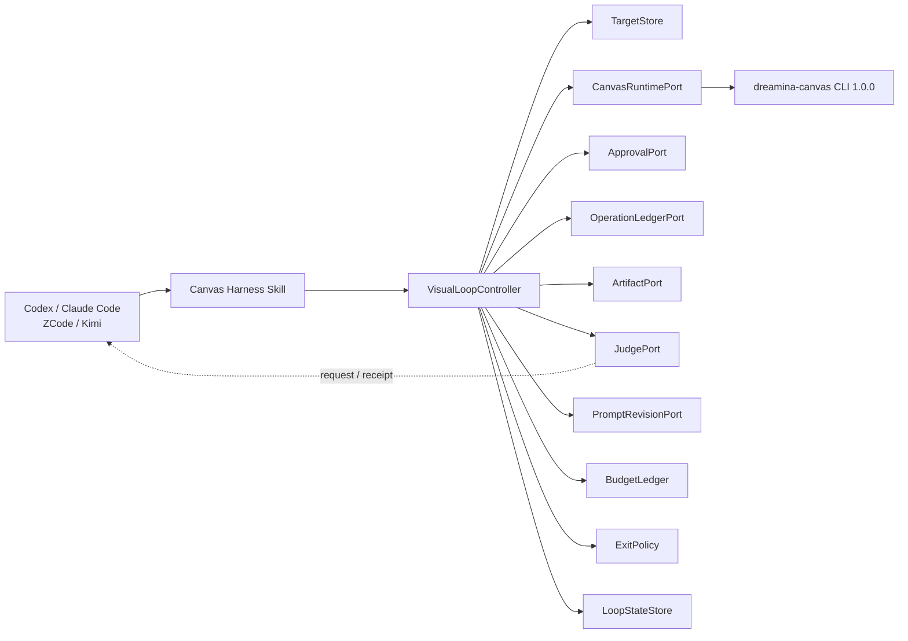
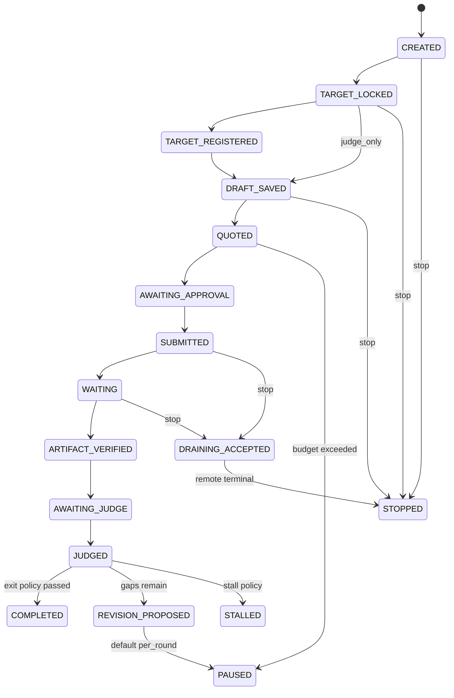

## Context

Canvas 插件当前是“Skills + 本地 CLI”插件，未声明 MCP Server 或 App Runtime。现有 Python 模块分别提供 CLI 适配、审批检查、操作账本、产物校验和错误路由，但没有生产控制器把这些能力组合成可恢复闭环。插件专属 Harness 又把尚未实现的产物镜像、`latest.png` 和外部 Judge 描述成自动能力，并使用了未由当前 CLI 验证通过的本地 URI 方案。

本变更跨越插件专属 Skill、上游受管技能、JSON Schema、Python 控制器、付费授权、宿主 Judge 和发布供应链。上游 `dreamina-skills` 是受管内容事实源，Canvas 仓库不得直接修补其 vendored 副本。现有本地未发布提交必须保留，实施时以普通增量提交演进，不重写用户历史。

## Goals / Non-Goals

**Goals:**

- 建立插件自有、可测试、可恢复的 `VisualLoopController`，而不是依赖模型按文档自觉串联 Skill。
- 以结构化状态和回执连接目标、生成请求、付费执行、产物、Judge 和 Revision。
- 第一里程碑只跑一轮，Judge 后暂停；后续在有界授权下才允许循环。
- 让 JudgePort 跨 Codex、Claude Code、ZCode、Kimi 保持相同语义。
- 对 macOS、Linux、Windows 使用相同持久化协议，不依赖软链接。
- 保持现有报价、显式审批、稳定请求标识、授权目录和事务下载边界。

**Non-Goals:**

- 不把 Canvas 插件改造成 MCP Server；当前控制器仍由 Skill/宿主调用本地 Python 与 CLI。
- 不复制 Dream Loop 的提示词、Fal 3D 程序或预览服务器。
- 不要求所有宿主具备相同子智能体 API，也不把 Dreamina Design 插件变成硬依赖。
- 不在本变更中绕过 CLI 的短期审批凭证或供应商付费控制。
- 不用模拟测试替代真实付费 Canary，不在没有取消 API 时实现伪取消。

## Decisions

### 1. 插件拥有控制器，Skill 只负责路由和交互

采用插件内 Python 控制器组合现有安全模块，并暴露机器可解析的命令入口。Skill 负责收集高价值输入、展示审批点和调用控制器，不承载状态机本身。



候选模块边界：

- `scripts/visual_loop_controller.py`：命令入口与状态转换。
- `scripts/visual_loop_state.py`：状态、原子持久化、恢复和锁。
- `scripts/canvas_runtime_port.py`：组合现有 `dreamina_canvas_adapter.py`，只接受结构化 CLI JSON。
- `scripts/judge_port.py`：JudgeRequest/JudgeReceipt 验证和适配器注册。
- `scripts/prompt_revision.py`：完整 generation block 重建。
- `scripts/budget_ledger.py`：预留、消费、未知费用和策略判断。

备选方案是把所有流程继续写进 `SKILL.md`。该方案无法证明崩溃恢复、幂等、预算和状态迁移，因此拒绝。

### 2. OpenSpec 和实现均以 Canvas 仓库为闭环事实源

Dreamina Design 的视觉 Judge Skill可以作为一个适配器，但其 proposal、版本和安装状态不决定 Canvas 状态机。Canvas 规格定义端口，适配器只负责履约。

备选方案是直接依赖兄弟仓库 proposal。该方案产生跨仓未发布依赖，无法单独安装和验收，因此拒绝。

### 3. 目标分为 `judge_only` 与 `canvas_reference`

`judge_only` 目标只在授权目录内用于本地或宿主 Judge。`canvas_reference` 通过 `resource upload --file` 注册，使用由目标身份派生或持久化的稳定 UUID 作为 `resourceId`，随后只使用 `res:<uuid>`。

不再依赖 `{{uri:file://...}}`。`uri:`、`vid:` 是否可用必须来自 CLI 实时 schema 或锁定版本的机器可读证据；技能文本不能覆盖运行时事实。

### 4. 六类主回执加 JudgeRequest

JSON Schema 使用 `additionalProperties: false`，时间使用 UTC RFC 3339，ID 使用规范 UUID，内容身份使用 SHA-256。所有落盘数据先经过秘密字段扫描和 schema 校验。

| 契约 | 核心字段 |
|---|---|
| `VisualTargetReceipt` | targetId、version、sha256、bytes、mediaType、dimensions、source、ingestionMode、resourceId、lockedAt |
| `VisualRoundReceipt` | sessionId、roundId、targetId、nodeId、mutationVersion、generationFingerprint、quoteRef、approvalRef、submitId、artifactRef、judgeRef、decision |
| `JudgeRequest` | requestId、target identity、candidate identity、rubricVersion、mediaType、fresh-context constraints |
| `JudgeReceipt` | judgeId、adapter、modelClass、target/candidate sha256、scores、gaps、recommendation、freshContext、sawPromptDraft、judgedAt |
| `LoopBudget` | mode、maxRounds、maxTotalCredits、maxPerRound、spent、reserved、unknown、deadline、stall policy |
| `VisualLoopState` | state、currentRound、bestRound、pendingOperations、receipt refs、stopRequested、revisionCount |
| `PromptRevisionReceipt` | baseMutationVersion、base/result fingerprint、judgeReceiptId、updateId、changedFields、result |

审批凭证不写入 `approvalRef`；这里只保存可验证的非敏感授权元数据，如 quoteId、ceiling、expiry 和 request fingerprint。

### 5. 状态机是唯一执行许可来源



所有状态写入采用同目录临时文件、fsync 和原子替换；写入前持有会话级文件锁。Windows 不使用 `latest.png` 软链接，而是保存不可变 `rounds/<round-id>/candidate.*` 和原子更新 `latest.json`。

### 6. 单轮控制器以暂停边界隔离外部副作用

单轮执行顺序：

1. 建立会话并锁定目标。
2. 按模式本地登记或幂等上传。
3. 发现当前 CLI schema、模型和运行能力。
4. 创建或更新 saved draft，但不运行。
5. 获取实时报价并写入预算预留提案。
6. 停在 `AWAITING_APPROVAL`，由宿主完成显式批准。
7. 使用一个稳定 `submitId` 提交；结果不明确时只恢复查询。
8. 事务下载、哈希和产物校验，通过后归档不可变候选。
9. 发出 JudgeRequest；无 Judge 时停在 `AWAITING_JUDGE`。
10. 接受有效 JudgeReceipt，输出完成或 Revision 提案；第一阶段不自动进入下一轮。

### 7. JudgePort 使用请求/回执，不直接控制宿主子智能体

控制器输出 JudgeRequest，当前宿主、外部 MCP 或人工流程返回 JudgeReceipt。适配器可以提供同步便捷调用，但控制器必须允许异步暂停和后续恢复。

Judge 默认只能看到目标、候选与 rubric。若宿主无法证明新鲜上下文，回执仍可保存为诊断证据，但不得满足自动退出门禁。跨宿主验收使用同一黄金语料和 schema，允许评分存在预定义容差，但要求关联、安全和字段语义完全一致。

### 8. Prompt Revision 全量替换 generation block

修订流程在写入前重新读取 live node，校验 `mutationVersion` 与 generation fingerprint。Prompt 重写器只接收验证后的 gap、用户约束和当前完整 generation block；输出必须包含完整 block，并经保真检查确认引用、模型、模式、尺寸、数量、时长等字段没有意外丢失。

每个更新使用稳定 `updateId`。超时后先 `node show` 或等价查询；只有能证明未应用时才安全重试。并发版本变化进入 `PAUSED`，不自动覆盖。

### 9. 预算采用保守预留，整批授权不替代供应商审批

默认模式为 `per_round`。`bounded_batch` 仅表达用户对目标、最大轮数、总费用、单轮费用和截止时间的控制器级授权。每轮仍需最新报价；若 CLI 的短期审批凭证按请求绑定，控制器必须逐轮暂停取得凭证。

预算计算：

```text
available = max_total - spent - reserved - unknown
```

远端已接受但结果未知的操作保持 `reserved` 或转为 `unknown`。本地超时、停止或进程退出不释放费用。只有权威终态和费用信息才能完成对账。

停滞策略同时观察总分改善、关键分项改善、重复 gap 和重规划次数。达到任何硬上限即停止自动推进并保留最佳候选。

### 10. 视频扩展复用状态机但增加 FrameSamplerPort

图像闭环通过后新增 `FrameSamplerPort`。采样回执绑定源视频 SHA-256、时长、帧率、采样时间和帧摘要。Judge 分别输出静态关键帧分数与时序门禁；没有帧采样或时序视觉能力时返回 `MANUAL_REVIEW_REQUIRED`。

FFmpeg 是可选适配器，不作为插件安装成功的强制依赖。缺少它只能降低视频自动 Judge 能力，不能让图像闭环失效。

### 11. 发布按上游技能、插件、市场仓三阶段推进

先修改 `dreamina-skills` 并发布不可变 tag，再通过锁生成工具同步 Canvas；随后实现、测试并发布 Canvas `0.2.0-rc.1` 或由发布脚本计算的等价 RC，最后同步市场仓。每一步验证 tag、commit、manifest、GitHub Release、安装缓存和宿主实际加载版本。

计划文档和未实现代码不触发版本 bump；代码或用户可见文档开始修改后，必须遵守仓库“每次改动均 bump 并发布”的要求。若尚未达到 RC 门禁，实施工作保持为未发布 change，不虚报市场可更新。

## Risks / Trade-offs

- [CLI schema 与技能契约继续漂移] → 在单元测试外加入 CLI schema 兼容测试，并要求上游不可变版本先发布。
- [整批预算被误认为可复用审批] → 把控制器策略与短期审批凭证分离，缺少当前凭证时固定停在 `AWAITING_APPROVAL`。
- [远端接受后本地崩溃导致重复扣费] → 提交前持久化稳定 `submitId` 和预留，再调用远端；恢复只查询同一操作。
- [Judge 看到 Prompt 后迎合预期] → 默认 JudgeRequest 排除 Prompt/历史，回执声明 fresh-context 约束，自动门禁只接受合规回执。
- [跨宿主评分不完全一致] → 只要求 schema/关联/安全一致；质量分数使用黄金样本容差和一致的通过规则，不追求逐 token 一致。
- [Windows 原子性和路径差异] → 使用 `pathlib`、规范路径包含检查、文件锁、原子 replace 和 `latest.json`，不使用软链接。
- [兄弟插件不可用] → JudgePort 支持外部 MCP、宿主子智能体和人工适配器，不把兄弟 Skill 设为硬依赖。
- [本地未发布提交与新实现冲突] → 不重写历史；实施前记录基线，按文件审查重叠并以新提交演进。
- [真实付费验收产生费用] → 默认使用 Fake CLI；真实 Canary 单独要求账户、有效凭证和明确费用上限。

## Migration Plan

1. 在 Canvas Harness 中将自动镜像、自动 Judge、本地 URI 等声明改为“计划/不可用”，不删除现有安全工作流。
2. 在上游 `dreamina-skills` 更新 CLI 1.0.0 资源契约、测试并发布新 tag；失败时停止后续锁更新。
3. 使用仓库同步工具更新 `skills.lock.json` 和受管技能，验证 tag、peeled SHA 与摘要。
4. 先提交 Schema、状态迁移和纯本地测试，再实现单轮 Fake CLI/Fake JudgePort E2E。
5. 接入真实 CLI 的只读 schema/model 探测；涉及上传或生成的 Canary 单独授权。
6. 完成 Prompt Revision、预算与停止恢复测试后，再开放有界多轮策略。
7. 图像门禁通过后加入视频采样与时序 Judge。
8. 在四宿主隔离安装中完成 JudgePort 黄金样本验收。
9. bump 插件 RC、发布不可变 tag/GitHub Release、同步市场仓并从市场重新安装验证。

回滚时停止新提交，保留 operation ledger 和回执以排空已接受任务；市场仓回退到最后稳定版本，但不删除远端操作证据或重写已发布 tag。

## Open Questions

- 真实 CLI 是否会在后续版本提供可验证的批量审批凭证；在此之前设计固定按轮获取短期审批。
- 四个宿主可用的视觉模型和子智能体接口可能变化；适配器能力通过验收矩阵记录，不写死在核心状态机。
- 视频时序 Judge 的黄金样本容差需要在图像阶段完成后用真实宿主校准，但不会改变回执、安全和降级协议。
