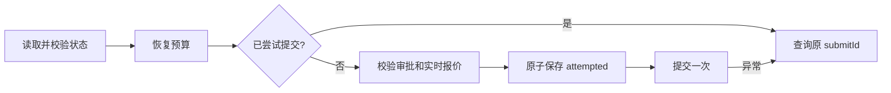

## Context

见 proposal.md；在当前 Brownfield 代码和规格上增量修复。

## Goals / Non-Goals

目标是恢复既有安全与兼容性承诺；不实现多轮执行、不安装工具、不运行付费 Canary。

## Decisions

状态新增可选 safety 快照，与状态原子写入；快照含预算、保留额、策略和报价绑定，不含 token。未具备安全快照的旧中途会话只能只读检查/人工对账，不能自动重新提交。初始旧状态可继续。控制器使用独立步骤锁避免并发提交，首次调用前持久化 attempted；不使用网络异常后重发。实时 node show 的完整生成块与项目/节点和报价上限生成指纹；审批必须显式携带该指纹。提交前重新读取报价，若内容变化停止。

## Risks / Trade-offs

- 本地 mock 回归不证明真实服务或 Windows 当前版本通过；历史证据注明日期。
- 首次提交前进程退出可能导致标记已尝试但未发送，仍只对账，优先防止重复计费。

## Migration Plan

先红灯回归、实现、完整相关检查；本地准备补丁版本。发布与远端操作单独遵循授权。
